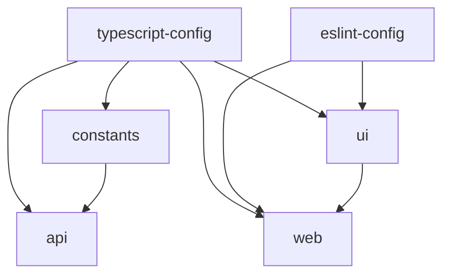

The Nexus Hotel platform uses Turborepo to manage a monorepo with multiple applications and shared packages.

## What is Turborepo?

<CardGroup cols={2}>
  <Card title="Task Orchestration" icon="diagram-project">
    Intelligent build system for JavaScript/TypeScript monorepos
  </Card>
  <Card title="Caching" icon="bolt">
    Remote and local caching for faster builds
  </Card>
  <Card title="Parallel Execution" icon="arrows-split-up-and-left">
    Run tasks across packages in parallel
  </Card>
  <Card title="Dependencies" icon="link">
    Automatic dependency graph resolution
  </Card>
</CardGroup>

## Monorepo Structure

```
proyecto-de-devops/
├── apps/
│   ├── web/              # Next.js frontend application
│   └── api/              # Hono.js API service
├── packages/
│   ├── ui/               # Shared React components
│   ├── constants/        # Shared constants
│   ├── eslint-config/    # Shared ESLint configurations
│   └── typescript-config/ # Shared TypeScript configurations
├── turbo.json            # Turborepo configuration
├── package.json          # Root package.json with scripts
└── pnpm-workspace.yaml   # pnpm workspace configuration
```

## Root Package Configuration

From `package.json`:

```json package.json
{
  "name": "proyecto-de-devops",
  "private": true,
  "scripts": {
    "build": "turbo run build",
    "dev": "turbo run dev",
    "lint": "turbo run lint",
    "format": "prettier --write \"**/*.{ts,tsx,md}\"",
    "check-types": "turbo run check-types"
  },
  "devDependencies": {
    "prettier": "^3.6.2",
    "turbo": "^2.5.5",
    "typescript": "5.8.3"
  },
  "packageManager": "pnpm@10.28.2",
  "engines": {
    "node": "22.x"
  }
}
```

## Turborepo Configuration

From `turbo.json`:

```json turbo.json
{
  "$schema": "https://turborepo.com/schema.json",
  "ui": "tui",
  "tasks": {
    "build": {
      "env": ["VERCEL"],
      "dependsOn": ["^build"],
      "inputs": ["$TURBO_DEFAULT$", ".env*"],
      "outputs": ["dist/**", ".next/**", "!.next/cache/**", ".vercel/output/**"]
    },
    "lint": {
      "dependsOn": ["^lint"]
    },
    "check-types": {
      "dependsOn": ["^check-types"]
    },
    "dev": {
      "cache": false,
      "persistent": true,
      "dependsOn": ["^build"]
    }
  }
}
```

## Key Features

### Task Pipeline

Turborepo automatically determines the order to run tasks based on dependencies.

<Tabs>
  <Tab title="Build Pipeline">
    When you run `pnpm build`:
    
    1. Builds `packages/constants` (no dependencies)
    2. Builds `packages/ui` (depends on TypeScript config)
    3. Builds `apps/api` (depends on constants)
    4. Builds `apps/web` (depends on ui package)
    
    ```bash
    pnpm build
    ```
    
    The `"dependsOn": ["^build"]` ensures dependencies are built first.
  </Tab>
  
  <Tab title="Dev Pipeline">
    Running `pnpm dev` starts all apps in development mode:
    
    ```bash
    pnpm dev
    ```
    
    Both `apps/web` and `apps/api` start simultaneously.
    
    The `"cache": false` and `"persistent": true` keep dev servers running.
  </Tab>
  
  <Tab title="Lint Pipeline">
    Run linting across all packages:
    
    ```bash
    pnpm lint
    ```
    
    Lints all packages in parallel with zero warnings tolerance.
  </Tab>
</Tabs>

### Workspace Dependencies

Packages reference each other using the `workspace:*` protocol:

```json
{
  "dependencies": {
    "@repo/ui": "workspace:*",
    "@repo/constants": "workspace:*"
  },
  "devDependencies": {
    "@repo/eslint-config": "workspace:*",
    "@repo/typescript-config": "workspace:*"
  }
}
```

<Note>
  The `workspace:*` protocol tells pnpm to link to the local workspace package instead of downloading from npm.
</Note>

### Caching

Turborepo caches task outputs for faster subsequent runs.

**Build Task Outputs:**
```json
"outputs": [
  "dist/**",           // Compiled TypeScript
  ".next/**",          // Next.js build output
  "!.next/cache/**",   // Exclude Next.js cache
  ".vercel/output/**"  // Vercel deployment output
]
```

When you run `pnpm build` again without changes, Turborepo restores from cache instantly.

### Dependency Graph



## Package Manager: pnpm

The monorepo uses pnpm for efficient dependency management.

**pnpm-workspace.yaml:**
```yaml
packages:
  - 'apps/*'
  - 'packages/*'
```

### Why pnpm?

<CardGroup cols={2}>
  <Card title="Disk Efficiency" icon="hard-drive">
    Shares dependencies across projects using hard links
  </Card>
  <Card title="Fast Installs" icon="bolt">
    Parallel installation with smart caching
  </Card>
  <Card title="Strict" icon="lock">
    Prevents phantom dependencies
  </Card>
  <Card title="Workspace Support" icon="folder-tree">
    First-class monorepo support
  </Card>
</CardGroup>

## Common Commands

<Tabs>
  <Tab title="Development">
    Start all applications in development mode:
    
    ```bash
    pnpm dev
    ```
    
    This runs:
    - `apps/web` on port 3001 (Next.js with Turbopack)
    - `apps/api` with srvx (hot reload)
  </Tab>
  
  <Tab title="Build">
    Build all applications and packages:
    
    ```bash
    pnpm build
    ```
    
    Turborepo builds in the correct order with caching.
  </Tab>
  
  <Tab title="Lint">
    Lint all packages:
    
    ```bash
    pnpm lint
    ```
    
    Runs ESLint with zero warnings tolerance.
  </Tab>
  
  <Tab title="Type Check">
    Check TypeScript types across all packages:
    
    ```bash
    pnpm check-types
    ```
  </Tab>
  
  <Tab title="Format">
    Format all code with Prettier:
    
    ```bash
    pnpm format
    ```
  </Tab>
</Tabs>

## Filtering Tasks

Run tasks for specific packages:

<CodeGroup>

```bash Run in specific app
# Build only the web app
turbo run build --filter=web

# Dev mode for API only
turbo run dev --filter=api
```

```bash Run in multiple apps
# Build both apps
turbo run build --filter=web --filter=api

# Or use glob patterns
turbo run build --filter='./apps/*'
```

```bash Include dependencies
# Build web app and its dependencies
turbo run build --filter=web...
```

</CodeGroup>

## Environment Variables

Turbo respects environment variables:

**In turbo.json:**
```json
"build": {
  "env": ["VERCEL"],
  "inputs": ["$TURBO_DEFAULT$", ".env*"]
}
```

**Usage:**
- `.env*` files are included as inputs for cache invalidation
- `env` array lists environment variables that affect the build

## TUI (Terminal UI)

Turborepo uses a terminal UI for better visibility:

```json
"ui": "tui"
```

This provides a rich, interactive terminal interface showing:
- Running tasks
- Task status (pending, running, completed)
- Build logs
- Cache hits

## Adding a New Package

<Steps>
  <Step title="Create Package Directory">
    ```bash
    mkdir -p packages/new-package/src
    cd packages/new-package
    ```
  </Step>
  
  <Step title="Create package.json">
    ```json
    {
      "name": "@repo/new-package",
      "version": "0.0.0",
      "private": true,
      "main": "./src/index.ts",
      "types": "./src/index.ts"
    }
    ```
  </Step>
  
  <Step title="Add to Workspace">
    The package is automatically detected because of `pnpm-workspace.yaml`:
    
    ```yaml
    packages:
      - 'packages/*'
    ```
  </Step>
  
  <Step title="Use in Other Packages">
    ```json
    {
      "dependencies": {
        "@repo/new-package": "workspace:*"
      }
    }
    ```
  </Step>
  
  <Step title="Import and Use">
    ```typescript
    import { something } from '@repo/new-package'
    ```
  </Step>
</Steps>

## Adding a New App

<Steps>
  <Step title="Create App Directory">
    ```bash
    mkdir -p apps/new-app
    cd apps/new-app
    ```
  </Step>
  
  <Step title="Initialize Package">
    ```bash
    pnpm init
    ```
  </Step>
  
  <Step title="Add Scripts">
    ```json
    {
      "name": "new-app",
      "scripts": {
        "dev": "your-dev-command",
        "build": "your-build-command",
        "lint": "eslint ."
      }
    }
    ```
  </Step>
  
  <Step title="Install Dependencies">
    ```bash
    pnpm add @repo/ui @repo/constants
    ```
  </Step>
</Steps>

## Remote Caching

For team collaboration, enable remote caching:

```bash
# Link to Vercel (free for hobby projects)
turbo login
turbo link
```

Now all team members share the same build cache.

## Performance Benefits

<CardGroup cols={2}>
  <Card title="Fast Builds" icon="bolt">
    Turborepo can be up to 85% faster with caching
  </Card>
  <Card title="Parallel Tasks" icon="arrows-split-up-and-left">
    Tasks run in parallel when possible
  </Card>
  <Card title="Incremental Builds" icon="layer-group">
    Only rebuild what changed
  </Card>
  <Card title="Smart Hashing" icon="fingerprint">
    Content-based cache invalidation
  </Card>
</CardGroup>

## Best Practices

<AccordionGroup>
  <Accordion title="Shared Configurations">
    Use shared packages for ESLint and TypeScript configs:
    ```json
    {
      "extends": "@repo/typescript-config/base.json"
    }
    ```
  </Accordion>
  
  <Accordion title="Consistent Node Version">
    Specify Node version in root package.json:
    ```json
    {
      "engines": {
        "node": "22.x"
      }
    }
    ```
  </Accordion>
  
  <Accordion title="Workspace Protocol">
    Always use `workspace:*` for internal dependencies:
    ```json
    {
      "dependencies": {
        "@repo/ui": "workspace:*"
      }
    }
    ```
  </Accordion>
  
  <Accordion title="Task Dependencies">
    Use `dependsOn` to declare task dependencies:
    ```json
    {
      "build": {
        "dependsOn": ["^build"]
      }
    }
    ```
  </Accordion>
</AccordionGroup>

## Troubleshooting

### Clear Cache

```bash
# Clear Turborepo cache
turbo clean

# Clear pnpm cache
pnpm store prune
```

### Rebuild Everything

```bash
# Delete all node_modules and reinstall
find . -name 'node_modules' -type d -prune -exec rm -rf '{}' +
pnpm install

# Force rebuild without cache
turbo run build --force
```

### Check Dependency Graph

```bash
# Generate dependency graph
turbo run build --graph
```

## Related Documentation

<CardGroup cols={3}>
  <Card title="Shared Packages" icon="box" href="/app/shared-packages">
    Learn about shared packages
  </Card>
  <Card title="Frontend" icon="react" href="/app/frontend">
    Next.js application
  </Card>
  <Card title="API" icon="server" href="/app/api">
    Hono.js API service
  </Card>
</CardGroup>

## External Resources

<CardGroup cols={2}>
  <Card title="Turborepo Docs" icon="book" href="https://turbo.build/repo/docs">
    Official Turborepo documentation
  </Card>
  <Card title="pnpm Docs" icon="book" href="https://pnpm.io">
    pnpm package manager documentation
  </Card>
</CardGroup>