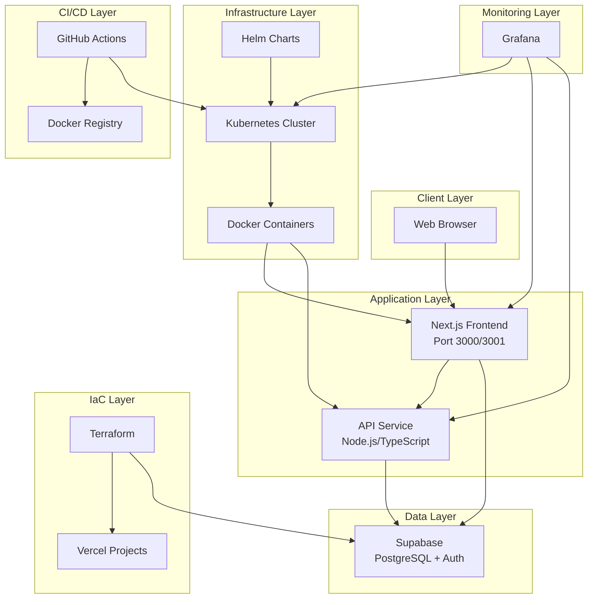

## Architecture Overview

Nexus Hotel is built on a modern, cloud-native architecture designed for **security, scalability, and high availability**. The platform follows microservices principles with clear separation of concerns.

<Note>
  The architecture is designed to handle sensitive customer data while maintaining high performance and 24/7 availability.
</Note>

## System Components



## Frontend Application

### Next.js Web Application

The frontend is built with **Next.js 16**, leveraging React 19 for a modern, performant user interface.

<CardGroup cols={2}>
  <Card title="Technology Stack" icon="react">
    - Next.js 16.0.10
    - React 19.2.1
    - TypeScript 5.8.3
    - Supabase Client
  </Card>
  <Card title="Key Features" icon="star">
    - Server-side rendering (SSR)
    - Turbopack for fast builds
    - Type-safe development
    - Real-time data updates
  </Card>
</CardGroup>

#### Application Structure

The web application is located at `apps/web` and includes:

- **Habitaciones** (Rooms) - Room booking interface
- **Restaurantes** (Restaurants) - Restaurant reservation system  
- **Experiences** - Event and meeting space booking

<Accordion title="package.json Configuration">
```json apps/web/package.json
{
  "name": "web",
  "version": "0.1.0",
  "scripts": {
    "dev": "next dev --turbopack --port 3001",
    "build": "next build",
    "start": "next start"
  },
  "dependencies": {
    "@supabase/supabase-js": "^2.94.0",
    "next": "^16.0.10",
    "react": "^19.2.1"
  }
}
```
</Accordion>

## API Service

The API service provides backend functionality and business logic processing.

### Technology Stack

<Info>
  Built with **Node.js 22** and TypeScript for type safety and modern JavaScript features.
</Info>

- **Runtime**: Node.js 22.x
- **Language**: TypeScript 5.8.3
- **Server Framework**: srvx 0.8.7
- **Package Manager**: pnpm 10.28.2

<Accordion title="API package.json">
```json apps/api/package.json
{
  "name": "api",
  "type": "module",
  "scripts": {
    "build": "tsc",
    "dev": "srvx",
    "start": "srvx dist/index.js"
  },
  "dependencies": {
    "@repo/constants": "workspace:*"
  }
}
```
</Accordion>

## Database Layer

### Supabase - PostgreSQL Database

<CardGroup cols={2}>
  <Card title="Database" icon="database">
    PostgreSQL with real-time subscriptions
  </Card>
  <Card title="Authentication" icon="lock">
    Built-in auth with JWT tokens
  </Card>
</CardGroup>

Supabase provides:
- **Secure data storage** for customer information, reservations, and payment data
- **Row-level security (RLS)** for data protection
- **Real-time subscriptions** for live updates
- **Authentication and authorization** out of the box

<Warning>
  All sensitive data including banking information is encrypted at rest and in transit using industry-standard encryption.
</Warning>

## Monorepo Architecture

The project uses a **Turborepo monorepo** structure for efficient code sharing and build optimization.

```
├── apps/
│   ├── web/          # Next.js frontend application
│   └── api/          # Node.js API service
├── packages/
│   ├── ui/           # Shared UI components
│   ├── constants/    # Shared constants
│   ├── eslint-config/    # Shared ESLint configuration
│   └── typescript-config/ # Shared TypeScript configuration
└── turbo.json        # Turborepo configuration
```

<Accordion title="Root package.json">
```json package.json
{
  "name": "proyecto-de-devops",
  "private": true,
  "scripts": {
    "build": "turbo run build",
    "dev": "turbo run dev"
  },
  "packageManager": "pnpm@10.28.2",
  "engines": {
    "node": "22.x"
  }
}
```
</Accordion>

## Infrastructure Layer

### Docker Containerization

The application uses **multi-stage Docker builds** for optimal production images.

<CardGroup cols={2}>
  <Card title="Development" icon="code">
    **Dockerfile.dev**
    - Hot-reload enabled
    - Port 3001
    - Development tools included
  </Card>
  <Card title="Production" icon="rocket">
    **Dockerfile**
    - Multi-stage build
    - Port 3000
    - Optimized, lightweight image
  </Card>
</CardGroup>

#### Production Dockerfile Architecture

<Steps>
  <Step title="Base Stage">
    Sets up Node.js 22-slim with pnpm package manager
    ```dockerfile Dockerfile
    FROM node:22-slim AS base
    ENV PNPM_HOME="/pnpm"
    RUN corepack enable
    ```
  </Step>
  
  <Step title="Builder Stage">
    Installs Turbo and prunes the workspace for the web app
    ```dockerfile Dockerfile
    FROM base AS builder
    WORKDIR /app
    RUN npm install -g turbo
    RUN turbo prune web --docker
    ```
  </Step>
  
  <Step title="Installer Stage">
    Installs dependencies and builds the project
    ```dockerfile Dockerfile
    FROM base AS installer
    RUN pnpm install
    RUN npx turbo run build --filter=web...
    ```
  </Step>
  
  <Step title="Runner Stage">
    Creates final production image and exposes port 3000
    ```dockerfile Dockerfile
    FROM base AS runner
    EXPOSE 3000
    CMD ["pnpm", "--filter", "web", "run", "start"]
    ```
  </Step>
</Steps>

<Info>
  **Docker Hub**: Production images are available at `ssubaru/nexushotel:latest`
</Info>

### Kubernetes Deployment

The application is orchestrated using **Kubernetes** for high availability and scalability.

<Accordion title="Deployment Configuration">
```yaml helm/templates/deployment.yaml
apiVersion: apps/v1
kind: Deployment
metadata:
  name: nexushotel
  namespace: nexushotel
spec:
  replicas: 3
  template:
    spec:
      containers:
        - name: web
          image: "ssubaru/nexushotel:latest"
          ports:
            - containerPort: 3000
          env:
            - name: NODE_ENV
              value: "production"
```
</Accordion>

#### Helm Chart Structure

The Helm chart (`/helm`) includes:

- **Deployment**: Configures 3 replicas for high availability
- **Service**: Exposes the application via ClusterIP
- **Ingress**: Manages external access
- **Namespace**: Isolated `nexushotel` namespace

<Accordion title="Chart.yaml">
```yaml helm/Chart.yaml
apiVersion: v2
name: nexushotel
description: Helm Chart para desplegar la aplicación web Nexus Hotel en Kubernetes
type: application
version: 0.1.0
appVersion: "1.0.0"
maintainers:
  - name: Nexus Hotel DevOps Team
```
</Accordion>

## Infrastructure as Code (IaC)

### Terraform Configuration

<Info>
  Terraform automates the creation and management of cloud infrastructure, ensuring consistency across environments.
</Info>

Terraform manages:
- Vercel project creation for both web and API
- Environment variable synchronization with Supabase
- Consistent configuration across production, preview, and development

<Accordion title="Terraform Resources">
```hcl terraform/main.tf
resource "vercel_project" "web" {
  name      = "hotel-project-web"
  framework = "nextjs"
  
  git_repository = {
    type = "github"
    repo = var.github_repo
  }
  
  root_directory = "apps/web"
  install_command = "pnpm install --prefix=../.."
  build_command   = "npx turbo run build --filter=web"
}

resource "vercel_project" "api" {
  name    = "hotel-project-api"
  root_directory = "apps/api"
  install_command  = "pnpm install --prefix=../.."
  build_command    = "cd ../.. && npx turbo run build --filter=api"
}
```
</Accordion>

#### Key Features

- **Automated Project Provisioning**: Creates `hotel-project-web` and `hotel-project-api`
- **Environment Variable Management**: Syncs Supabase credentials across all environments
- **Database Consistency**: Ensures frontend and API use the same database
- **Version Control**: Infrastructure is versioned as code

## CI/CD Pipeline

### GitHub Actions Workflows

<CardGroup cols={2}>
  <Card title="Continuous Integration" icon="code-branch">
    - Build validation
    - Type checking
    - Linting
    - Docker image creation
  </Card>
  <Card title="Continuous Deployment" icon="rocket">
    - Automated on merge to main
    - Helm chart updates
    - Kubernetes deployment
    - Zero-downtime releases
  </Card>
</CardGroup>

<Warning>
  **Required Secret**: `KUBECONFIG` must be configured in GitHub repository settings for automated Kubernetes deployments.
</Warning>

## Monitoring and Observability

### Grafana Monitoring

<Info>
  Grafana provides real-time monitoring of system performance, resource utilization, and application health.
</Info>

Monitoring capabilities:
- Real-time performance metrics
- System health dashboards
- Resource utilization tracking
- Automated alerting for critical issues
- Capacity planning insights

## Deployment Environments

<CardGroup cols={3}>
  <Card title="Development" icon="laptop-code">
    - Local Docker containers
    - Port 3001
    - Hot-reload enabled
    - Debug tools active
  </Card>
  <Card title="Staging" icon="vial">
    - Kubernetes cluster
    - Preview deployments
    - Production-like environment
    - Testing and validation
  </Card>
  <Card title="Production" icon="server">
    - Kubernetes cluster
    - 3 replicas minimum
    - Load balancing
    - Auto-scaling enabled
  </Card>
</CardGroup>

## Security Architecture

<Steps>
  <Step title="Authentication Layer">
    Supabase handles user authentication with JWT tokens and secure session management
  </Step>
  
  <Step title="Network Security">
    - HTTPS/TLS encryption for all traffic
    - Network policies in Kubernetes
    - Ingress controller with SSL/TLS termination
  </Step>
  
  <Step title="Data Security">
    - Encryption at rest for database
    - Row-level security (RLS) policies
    - Environment variable encryption
  </Step>
  
  <Step title="Application Security">
    - Automated vulnerability scanning
    - Dependency updates and patching
    - Security-focused code reviews
  </Step>
</Steps>

## Scalability Features

<Accordion title="Horizontal Scaling">
  Kubernetes automatically scales the number of pod replicas based on CPU and memory utilization, handling traffic spikes during peak booking periods.
</Accordion>

<Accordion title="Vertical Scaling">
  Resource requests and limits are configured per container, allowing efficient resource allocation and preventing resource exhaustion.
</Accordion>

<Accordion title="Database Scaling">
  Supabase provides connection pooling and read replicas for database scaling as the user base grows.
</Accordion>

<Note>
  The architecture is designed to handle high-demand periods such as holiday seasons and special events through automated scaling mechanisms.
</Note>
